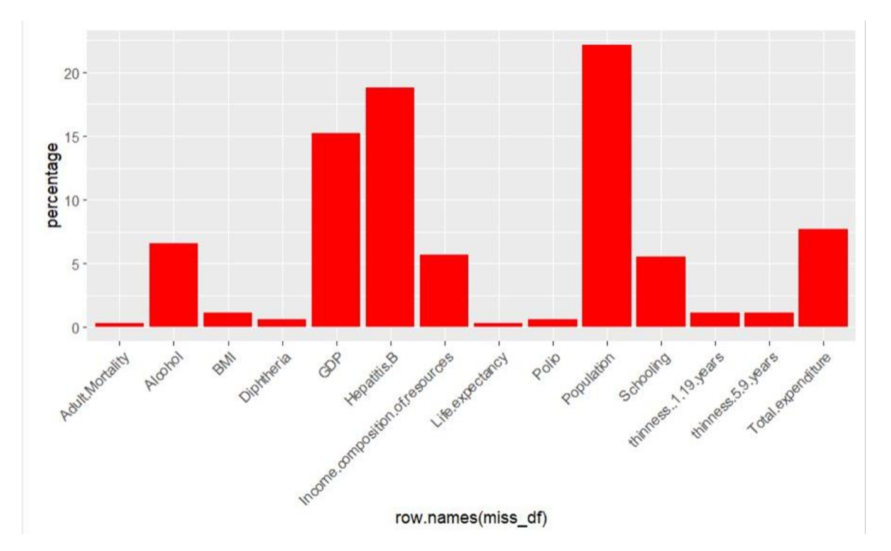
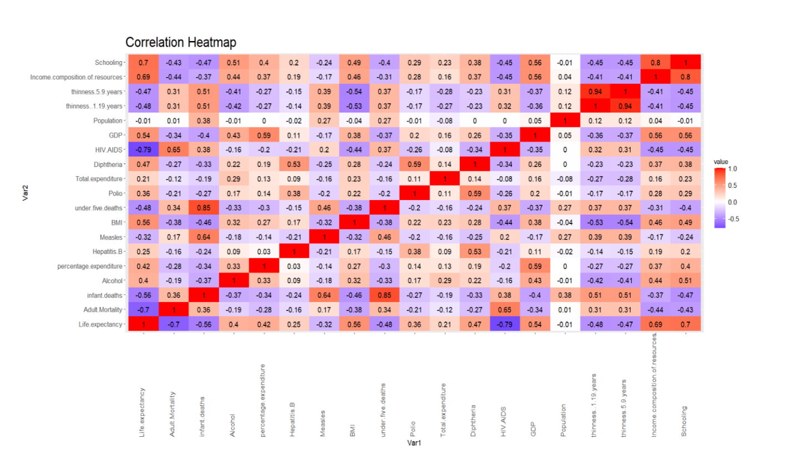
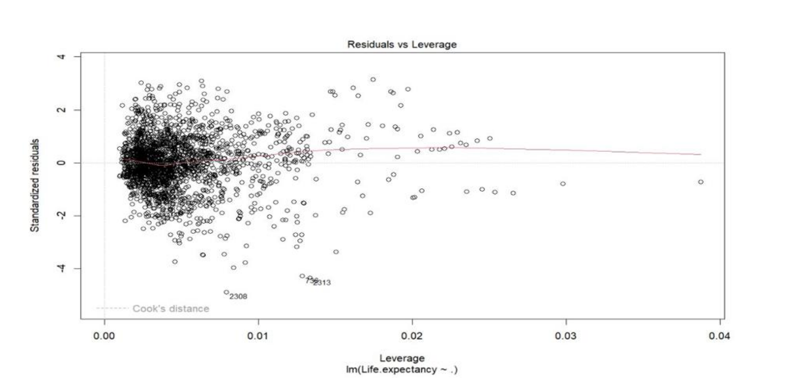
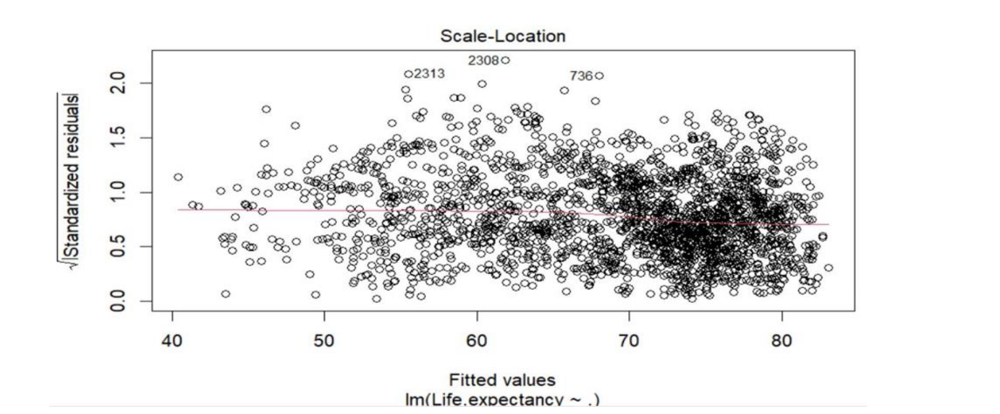
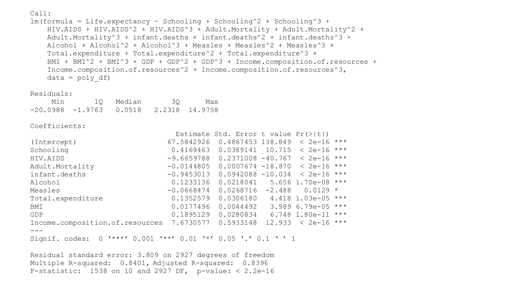

# Life Expectancy Data Analysis

**Summary**

This project analyzes life expectancy data from 193 countries over a 15-year period to uncover key factors that influence lifespan. By examining variables like alcohol consumption, health expenditure, disease prevalence (e.g., Hepatitis B, HIV), GDP, and mortality rates, the analysis seeks to identify significant predictors of life expectancy and their impacts. Visualization techniques and statistical tools like Correlation Analysis, ANOVA, and LASSO Regression were used to filter out influential predictors and understand their relationships with life expectancy.

Further modeling was performed with Multiple Regression and Polynomial Regression, applying the Akaike Information Criterion (AIC) to select the optimal model. The findings address questions such as the influence of healthcare spending, education, and lifestyle choices on life expectancy, providing insights that can guide public health policies and interventions to improve lifespan in diverse populations.

**Key Skills Used**

* Data Cleaning and Preprocessing
    
* Statistical Analysis: Applied ANOVA and Correlation Analysis to identify significant relationships among variables.
    
* Regression Modeling: Built predictive models using Multiple Regression, Polynomial Regression, and LASSO Regression to select key predictors.

* Model Evaluation and Selection: Used metrics like Akaike Information Criterion (AIC) to compare models and select the best-fit model.

* Data Visualization
    


## Installation

**Prequisites**

* R

* R studio (Optional)


**Installation** 

1. Clone the Repository: 

```
git clone https://github.com/yourusername/life-expectancy-analysis.git
cd life-expectancy-analysis

```

2. Install packages

```
install.packages(c("ggplot2", "dplyr", "car", "MASS", "glmnet"))

```
3. Run the Rmd file 

4.  Open and run the ```R_project.nb.html```file in RStudio or using the command line in R to view the full analysis and visualizations.


## Demo


                         Missing Values Graph 



                        Correlation Heat map


                
                 Multiple regression Residuals vs Leverage



               root standard residuals vs Fitted values



                Result




